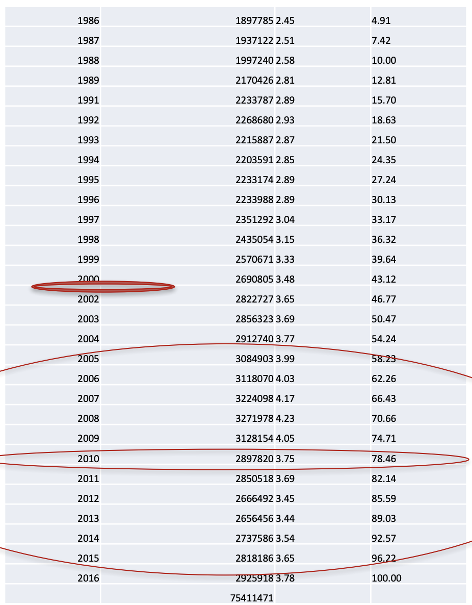

```{r setup, include=FALSE}
knitr::opts_chunk$set(collapse = FALSE, echo = TRUE)
library(magrittr)
library(dplyr)
library(ggplot2)
library(formattable)
```


# The Sample

Our sample contains a very large number of observations, more than 4mio, for a selection of variables from the data set described below. It is available in `.dta` format [here.](sampleqp.dta)  

### The Full Original Data Set

The data set was collected by [Statistics Portugal (Instituto Nacional de Estatística)](https://www.ine.pt/xportal/xmain?xpgid=ine_main&xpid=INE) on variables related to the Portuguese labor market, including information related to the wage, the worker, the employer/firm, etc... In short, this is a very rich data set that has already allowed for numerous relevant studies (e.g., [Cabral and Mata (2003), _American Economic Review_](https://www.jstor.org/stable/pdf/3132279.pdf)^[Abstract: _Using a comprehensive data set of Portuguese manufacturing firms, we show that the firm size distribution is significantly right-skewed, evolving over time toward a lognormal distribution. We also show that selection accounts for very little of this evolution. Instead, we propose a simple theory based on financing constraints. A calibrated version of our model does a good job at explaining the evolution of the firm size distribution._], [Buhai, Portela, Teulings and van Vuuren  (2014), _Econometrica_](https://onlinelibrary.wiley.com/doi/epdf/10.3982/ECTA8688)^[Abstract: _This study documents two empirical facts using matched employer–employee data for Denmark and Portugal.  First, workers who are hired last, are the first to leave the firm. Second, workers' wages rise with seniority, where seniority is defined as a worker's tenure relative to the tenure of his colleagues. Controlling for tenure, the probability of a worker leaving the firm decreases with seniority. The increase in expected seniority with tenure explains a large part of the negative duration dependence of the separation hazard. Conditional on ten years of tenure, the wage differential between the 10th and the 90th percentiles of the seniority distribution is 1.1–1.4 percentage points in Denmark and 2.3–3.4 in Portugal._], etc) in a very large set of topics (e.g., income inequality, social mobility, returns to education, wage discrimination, etc)

To get a better idea, notice the following features of the overall data set:  

- more than 75 million observations,
- panel data structure, meaning that relevant statistics can be calculated for any given year and/or followed over time,
- individuals are tracked over time,
- period from 1986 to 2016,
- relatively high accuracy, 
- publicly available (under qualified request),
- ...

Figure \@ref(fig:nobs-time) shows the number of observations in each year. Notice the absence of data for the year 2001 as well as a change in the data collection that took place in 2010.^[I do not think that any of these problems is of nature of compromising the overall extremely good quality of the data.]


```{r nobs-time, echo=FALSE, fig.align='center', out.width='40%', fig.cap="Number of observations over time." }

```


The Banco de Portugal has produced a document that describes the various variables as well as selected details about their construction. Find it [here.](manual_qp_v7.pdf)


# Reading the Data into R

Our first step will be to read the data into R. As wrote above, the data is in `.dta` format.

```markdown
sampleqp.dta
```

What is a `.dta` file? A quick Google search says it's a [Stata](https://www.stata.com/) data file.  

There are several packages that allow to read a `.dta` file into R (e.g., {haven}, {foreign}).^[Notice that they can handle several types of data files, i.e., they are not specific to Stata data files.] I use Wickham's package.

```{r}
library("haven") 
```

Make sure the relative path is correct and read the data as follows. Notice the very simple name I chose for the data frame object, `df`.

```{r, eval=FALSE}
df <- read_dta("sampleqp.dta")
```

### Save Future Time

Because the file is very large, the reading can take a few seconds. To avoid wasting time, I suggest reading it only once, save the object in R format and then load it again when necessary.^[I do exactly that here. This is why my read/save chunks have the options `eval=FALSE`.]

```{r, eval=FALSE}
save(df, file="sampleqp.Rdata")
```

Later, we can simply load the `.Rdata` that will contain the `df` object. 

```{r}
load("sampleqp.Rdata")
```


# First Look

The data set tidy. It has `r comma(nrow(df), big.mark="'", digits=0)` observations, each observation is one worker in some year. It's a large data set. And there are `r ncol(df)` variables. These are the following.

```{r}
names(df)
```
Also, let's have a look at the type of variables that we have.

```{r}
str(df)
```

This is a bit of a mess and I suggest cleaning it in a few steps.

# Remove Square of Variables 

The variables ending with a `2` are the squares of the other variables. Let's be picky here and agree that we don't need them.^[And, if we do, we can always create them.] 

```{r}
 df <- df %>%
  select(-age2, -tenure2)
```


# Remove Attributes

The attributes of the variables are information about the object that was stored by the provider of the data. This can be useful and up to crucial in some rare cases. 


```{r}
attributes(df$worker)
```

For instance, the attributes are `r names(attributes(df$worker))[1]`, some information about the variable and `r names(attributes(df$worker))[2]`, self-explanatory. For clarity, even if it is far from necessary, let's get rid of them.^[Roughly speaking, the code apply to the data set `df` a function that affects (turns `NULL`) the attributes of the variables in the data set.]

```{r}
df <- lapply(df, function(x) { attributes(x) <- NULL; x }) %>%
  as_tibble()
str(df)
``` 

Much cleaner!


# Correct Type of Variables

A much serious problem has to do with the type of variables. Clearly, all these variables are **not** numeric variables, as currently assumed. For instance, even if the variables `worker` and `firm` use numeric values, these are more like character id's. Let's change them.  

At the introductory level, and because there aren't many variables, we could go the pedestrian way, i.e., make the change manually. Notice that there is a choice under the hood, here. I chose to turn into factors the variables that had a relatively small number of categories.^[To see which one apply, simply turn all the possible candidates into factors, check the number of levels, and change the code accordingly.]  

```{r, tidy=FALSE}
df <- df %>%
  mutate(worker= as.character(worker),
         firm= as.character(firm),
         job_title= as.character(job_title),
         hab_comp3= factor(hab_comp3),
         sect_comp4= factor(sect_comp4))
```

### Advanced Alternative

Advanced users will use the {dplyr} function `across()`. 

```{r}
 df <- df %>% 
   mutate(across(c("worker", "firm", "job_title"), as.character),
          across(c("hab_comp3", "sect_comp4"), as.factor))  
```


# Dummy Into Factor

Several data sets use dummy variables to code categorical variables. For instance, here, the gender of the worker is given in the variable `male`. This latter takes the value 1 if the individual is a male, 0 otherwise.  

As we know, this is not the most appropriate way of handling categorical variables. Instead, one should use a specific type of variable, called `factor` in R. I make the change here.

```{r}
df <- df %>%
  mutate(gender = factor(case_when(
            male == 1 ~ "Male",
            TRUE ~ "Female"
            )))
```


# Renaming

You really don't want to code with long and cryptic variable names such as `log_t_real_h_wage` or `hab_comp3`. Here, I rename the variables (and delete the no longer necessary `male` variable)


```{r}
df <- df %>%
  select(-male) %>%
  rename(lwage = log_t_real_h_wage,
          education = hab_comp3,
          sector = sect_comp4)
```

# Last Look

Let's see what we have now.

```{r}
str(df)
```

Much better. We can start the analysis.
