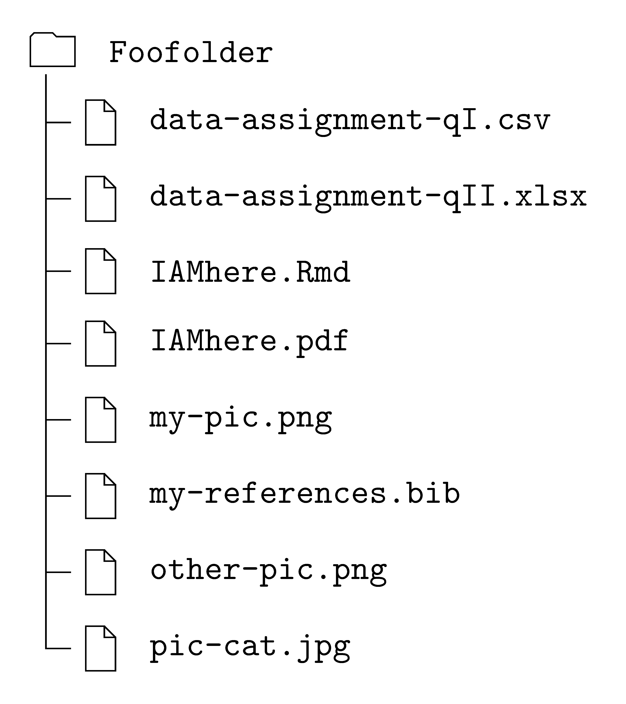
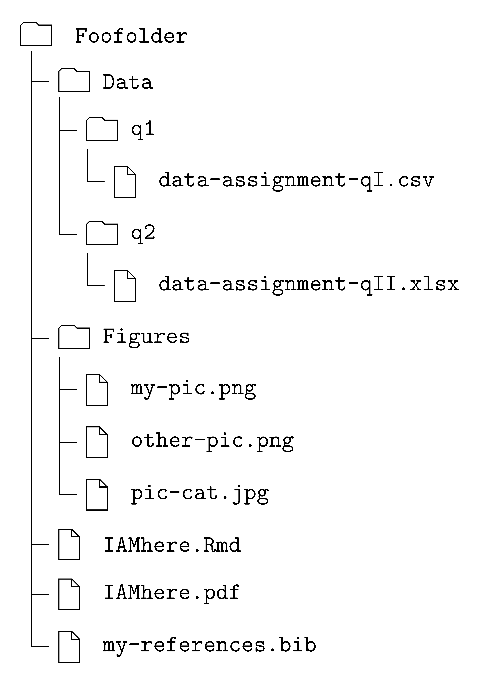
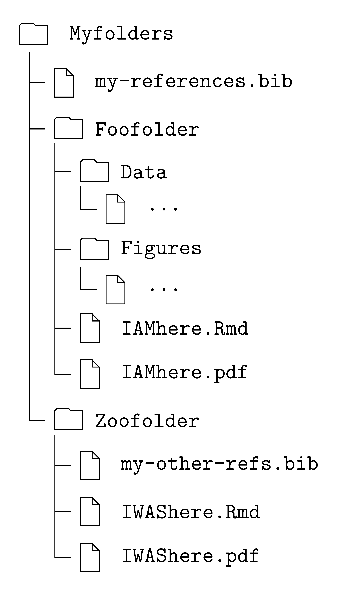

```{r setup, include=FALSE}
knitr::opts_chunk$set(collapse = FALSE)
```

You (almost) always need to incorporate external files for your analysis into the Rmd. Be it to:  

- include a picture file,
- read a data file,
- use a bibliography file,
- ...

To do it, we must provide, in code, the instructions of where to find the external file, i.e., its "address". This is called **to give the path** of a file.

# Absolute vs Relative Path


## Absolutely Avoid the Absolute Path

The path is absolute when it starts at the root of the computer's directory, e.g.,

```markdown
C:\Documents\r-class\data-assignment.xlsx
```

```markdown
/users/myname/r-class/mypic.png
```

In other words, the absolute path starts from the root of your computer and then enumerates all the folders that the software must dig into until it finds the external file.   

To guarantee reproducibility, you must absolutely avoid this way of giving the path.[^your]

## Use the Relative Path

The path of an external file is relative when the "address" of this latter is given **relative** to the current (Rmd) file. 

In other words, the relative path starts from the current folder of your Rmd and enumerates the folders that the software must navigate until it finds the external file. 


Only relative paths guarantee reproducibility. Indeed, if you share a bundle of files with a given structure, then the relative paths (between files) don't change.   


# Simplest Relative Path

Understanding and writing relative paths really is a part of basic computer skills.[^skill] But some students remain reluctant to make the step.  

In that case, there is an easy solution: **just put everything in the same folder**, i.e., your Rmd and all your external files.

Figure \@ref(fig:directory0) shows this. You decided to call your folder `Foofolder` and then threw everything in, starting with your Rmd file, `IAMhere.Rmd`.

```{r directory0, echo=FALSE, fig.align='center', out.width='40%', fig.cap='"Throw-everything-in" folder.' }

```

## Pros

With this solution, the path of a file is simply the name of the file, including extension. For instance, we can include `my-pic.png` in the `IAMhere.Rmd` with:

```{r, eval=FALSE}
knitr::include_graphics("my-pic.png")
```


## Cons

The problem with the easy solution is that your folder can very quickly become a mess. If you allow for it, it will be not only  aesthetically unpleasant, but also increasingly inefficient with the size of your project.  

Taking a step back, this solution means also that if you want to use the same external file in the different Rmds, then you must either put all these Rmds in the same folder or copy-paste the external file into the various folders containing the Rmds.  

Overall, though simple, this solution gives an amateurish feeling...


# Relative "Downwards" Path 

An external file is "downwards" relative to your Rmd if it is inside a folder contained by the folder of your Rmd.[^down]  In other words, the external file is "downwards" if it is in a **sub-folder**.     

It's easier than it reads! Figure \@ref(fig:directory1) shows downwards files. For instance, all the .png files are downwards because they are inside a folder, `Figures`, that is contained by the folder of your Rmd, `Foofolder`.[^other]   

```{r directory1, echo=FALSE, fig.align='center', out.width='40%', fig.cap="Organized folder containing other folders. (Splitting of `Data` into `q1` and `q2` is silly and it's meant only for illustration purposes.)" }

```


The relative path to these external files is then the name of the file, with extension, preceded by the name(s) of the folder(s) containing them. All these names are separated by slashes whose direction, `\` or `/`, depends on your operating system.  

For instance, in `IAMhere.Rmd`, I would include `my-pic.png` and read `data-assignment-QI.csv` by giving the  following paths in the appropriate functions, as


```{r, eval=FALSE}
knitr::include_graphics("Figures/my-pic.png")
```

and

```{r, eval=FALSE}
df <- read_csv("Data/q1/data-assignment-QI.csv")
```

Let's unpack this latter call.

- You are writing in `IAMhere.Rmd` which is in the folder `Foofolder`.
- When the software reads `Data/`, it expects to find a folder called `Data` inside `Foofolder`.[^error]   
- From there it reads on: `q1/`. So it expects to find a folder called `q1` inside `Data`.[^error]  
- From there it reads on: `data-assignment-QI.csv`. So it expects to find the external file in `q1`.[^error]


In general, it is good practice to organize your folder with internal folders for different file types.[^exa] 


# Relative "Upwards" Path 

The external file is "upwards" relative to your Rmd if it is in a folder that contains the folder that contains your Rmd. In other words, the external file "upwards" if it is in a **parent** folder.  

Complicated? Look at Figure \@ref(fig:directory2). As before, your Rmd is inside `Foofolder`. But now, the external file that you want to incorporate, `my-references.bib`, is outside this latter. It's in the parent folder `Myfolders` that contains, beyond the .bib, `Foofolder` and `Zoofolder`.[^why] 


```{r directory2, echo=FALSE, fig.align='center', out.width='40%', fig.cap='External file (.bib) outside current folder.' }

```


To look for a file in a parent folder, start the path with  `../` or `..\` (depending on the operating system). When the software reads the `../` or `..\` in a path, it interprets it as "first go up one level in the directory". And then proceed to give the path from that parent directory.[^double]  

For instance, to use `my-references.bib` in `IAMhere.Rmd`, the YAML would need to have:

```yaml
bibliography: "../my-references.bib"
``` 

Let's unpack it.

- You are writing in `IAMhere.Rmd` which is in the folder `Foofolder`.
- When the software reads `../` in the path, it says: "look in the parent of the current folder, i.e., `Foofolder`". So it will look in the folder `Myfolders`.
- From there, it reads on: `my-references.bib`. So it expects to find the external file in `Myfolders`.[^error]


## Check Your Understanding

Just to make sure the point is well taken. Consider the following question related to Figure \@ref(fig:directory2).  

You are writing in `IWAShere.Rmd` and you and to include the external file `my-pic.png`.[^recall] What is the relative path?

```{r, eval=FALSE}
"../Foofolder/Figures/my-pic.png"
```


[^your]: Recall, if you give the path in your machine, how will I be able to knit your Rmd.  
[^skill]: So, nothing specific to R/RStudio alone.
[^down]: In a sense, "downwards" means "downwards the directory".
[^other]: So are the .csv, .xlsx and the .jpg files. Notice that the .bib file is not downwards but at the same level as the .Rmd.
[^error]: And it's better be there. Otherwise, the software will scream an error.
[^exa]: In that sense, the extra separation of `Data` into `q1` and `q2` is, in general, unnecessary. I did it only to illustrate a downward path with a couple of sub-folders.  
[^why]: Why would you want to have this structure? It's unclear. Perhaps because you want to use `my-references.bib` in `IAMhere.Rmd` and in `IWAShere.Rmd`.
[^double]: The same applies to go up two parent folders: `../../`. But it is very unlikely that you will ever need to write it. 
[^recall]: From Figure \@ref(fig:directory1), you know that `my-pic.png` is in the folder `Figures`, but it is not shown in Figure \@ref(fig:directory2) where I used `...`.

