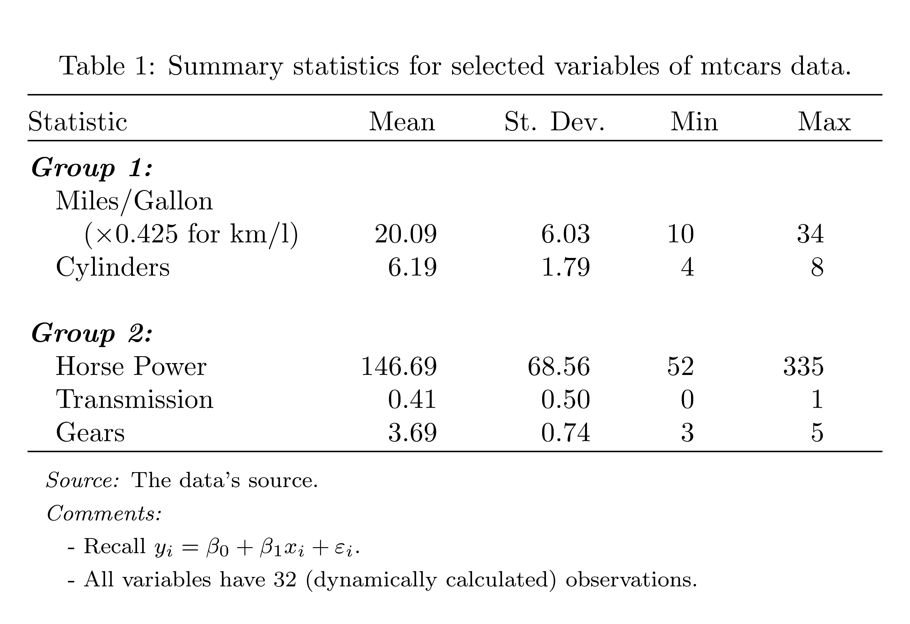
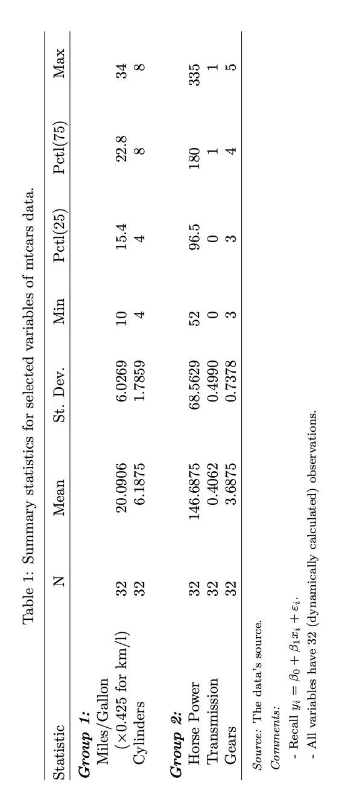

# Pros & Cons {#proscons}

### Pros {-}

1. Out-of-the-box, easy to use, all-in-one solution.
2. The package is "compulsory" for tables of estimated models. So it only requires marginal effort to learn the extra arguments related to summary statistics. As a side bonus, one gets the consistency in the formatting.

### Cons {-}

1. The package is somewhat flexible, and built to cover all the standard needs of the practitioners. But the advanced user is doomed to face a case that is not covered by the package options, forcing them to learn an alternative way.  


### My View {-}

I do not use {stargazer} for summary statistics. Instead, I build my own tables with {dplyr} and {kableExtra}.^[Stuff for another post.] But {stargzer} is so good and so accessible that R users cannot ignore it.

For instance, a important limitation of the `stargazer()` function for summary statistics is that it does not include the categorical variables. This actually makes sense, but one could want to see, at least, a count for each category.^[For instance, a summary statistics table for the `iris` data set would not include any information about the variable `Species` (and its three levels: setosa, versicolor, and virginica).] 


# Minimal Example

Let's start with a minimal example that illustrates the usage of some the arguments related to the summary statistics.^[All the arguments of the function `stargazer()` can be found [here](https://www.rdocumentation.org/packages/stargazer/versions/5.2.3/topics/stargazer).]

```{r, message=FALSE}
# use chunk option message=FALSE to avoid package info in the output
library(stargazer)  
library(dplyr) 
library(magrittr)
```

- `results='asis'`, the table is created in a R chunk that needs that chunk option.


````
```{r, results='asis'}`r ''`

```
````

- `select()` the variables to be included in the summary with a {dplyr} function.
- `as.data.frame()` enters the pipe for security because `stargazer()` requires a base R data frame, not a tibble,^[I don't understand this behavior! And it took me an hour to figure it out.]
- `type` for a table takes here a `ifelse` function so that the code works for all  the formats. In a research paper, `type='latex'` would suffice.^[Recall that you are reading this online. The format is slightly different from the format in the pdf.] 
- `label`, required for {knitr}-type of cross-referencing, is a patch solution found [here](https://github.com/rstudio/bookdown/issues/175#issuecomment-422100007).^[In a research paper, simply give there the label of the table, e.g., `label = "my-table-sum01"`.]
- `title` gives the caption of the table. In a pdf, the caption will typically be preceded by "Table 1:".
- `header = FALSE` is a weird but necessary requirement: it prevents the package information to be printed in the pdf.


```{r summstat01, results='asis'}
mtcars %>% 
  select(mpg, cyl, hp, am, gear) %>% 
  as.data.frame() %>%
  stargazer(type = ifelse(knitr::is_html_output(), 'html', 'latex'),
            label = knitr::opts_current$get("label"),
            title = "Summary statistics for selected variables of mtcars data.",
            header = FALSE
            )
```


# Nicer 

### Digits & Labels


Let's tweak the minimal case with some aesthetic elements.

- `digits` for the number of decimals.
- `digit.separator` for the thousands mark.
- `initial.zero` for yes/no the 0 before the comma.
- `covariate.labels` allows to change the name of the variables by giving a vector of names in the argument. Use `NA` in that vector for the variables you don't want to rename.

```{r summstat02, results='asis'}
mtcars %>%
  select(mpg, cyl, hp, am, gear) %>% 
  as.data.frame() %>%
  stargazer(type = ifelse(knitr::is_html_output(), 'html', 'latex'),
            label = knitr::opts_current$get("label"),
            title = "Summary statistics for selected variables of mtcars data.",
            header = FALSE,
            
            digits = 2,
            digit.separator= "'",
            initial.zero = FALSE,
            covariate.labels = c("Miles/Gallon", NA, "Horse Power", NA, "Gears")
            )
```


### Vertical

With the argument `flip`, we can exchange the position of the statistics and the variables. `FALSE` is the default, and `TRUE` lists the statistics of the left column of the table.  


```{r summstat02b, results='asis'}
mtcars %>%
  select(mpg, cyl, hp, am, gear) %>% 
  as.data.frame() %>%
  stargazer(type = ifelse(knitr::is_html_output(), 'html', 'latex'),
            label = knitr::opts_current$get("label"),
            title = "Summary statistics for selected variables of mtcars data.",
            header = FALSE,
            digits = 2,
            digit.separator= "'",
            initial.zero = FALSE,
            covariate.labels = c("Miles/Gallon", NA, "Horse Power", NA, "Gears"),
            
            flip = TRUE
            )
```


# Selection of Statistics

The default statistics are coded internally with the following abbreviations: `n`, `mean`, `sd`, `min`,  `p25`, `p75`, `max` (shown by default in that order), and `median`.

You can choose which set of statistics to display:

- `summary.stat` for "positive" choice, i.e., a vector of desired statistics to display,
- `omit.summary.stat` for "negative" choice, i.e., a vector with the desired statistics to remove from the default.


```{r summstat03, results='asis', out.width="80%"}
mtcars %>%
  select(mpg, cyl, hp, am, gear) %>% 
  as.data.frame() %>%
  stargazer(type = ifelse(knitr::is_html_output(), 'html', 'latex'),
            label = knitr::opts_current$get("label"),
            title = "Summary statistics for selected variables of mtcars data.",
            header = FALSE,
            digits = 2,
            digit.separator= "'",
            initial.zero = FALSE,
            covariate.labels = c("Miles/Gallon", NA, "Horse Power", NA, "Gears"),
            
            # summary.stat = c("n", "mean", "sd", "median"),
            omit.summary.stat = c("min", "max", "p25", "p75")
            )
```


# Notes for the Table

- `notes` allows to add extra explanatory notes to the table by taking a vector. **Each element** of the vector will be **a line** under the table.

- `notes.align` controls the alignment of the notes: `l`(eft), `c`(enter) or `r`(ight).

```{r summstat04, results='asis', out.width="80%"}
mtcars %>%
  select(mpg, cyl, hp, am, gear) %>% 
  as.data.frame() %>%
  stargazer(type = ifelse(knitr::is_html_output(), 'html', 'latex'),
            label = knitr::opts_current$get("label"),
            title = "Summary statistics for selected variables of mtcars data.",
            header = FALSE,
            digits = 2,
            digit.separator= "'",
            initial.zero = FALSE,
            covariate.labels = c("Miles/Gallon", NA, "Horse Power", NA, "Gears"),
            # summary.stat = c("n", "mean", "sd", "median"),
            omit.summary.stat = c("min", "max", "p25", "p75"),
            
            notes = c("My notes line 1.",
                      "My notes line 2."),
            notes.align = "r"
            )
```


# `r ifelse(knitr::is_html_output(), '$\\LaTeX$', '\\LaTeX')`

It is fair to say that {stargzer} was initially designed for academic publications. Many of these latter use `r ifelse(knitr::is_html_output(), '$\\LaTeX$', '\\LaTeX')` for text editing. So here are a few points to specifically address the usage with $\LaTeX.$       

- `out` is the solution for a special group of users, those who make the surprising choice of using R for data analysis and a `r ifelse(knitr::is_html_output(), '$\\LaTeX$', '\\LaTeX')` distribution for text editing. But they don't combine the these two tasks in a Rmd file.    
For this group of users, the {stargazer} table must find its way from the R code to the `r ifelse(knitr::is_html_output(), '$\\LaTeX$', '\\LaTeX')` file. This is achieved with this argument, `out`. The value of this latter is the name of the file, with extension (!),^[Various extensions/ file types are possible.] that will contain the code of the table.^[Notice that the type of the table is not given by the argument `type` (I'm not even using it), but by the extension of the file name in `out`.]  
- `align` forces the numbers in the columns to be aligned at the decimal mark. This requires the usage of the `r ifelse(knitr::is_html_output(), '$\\LaTeX$', '\\LaTeX')` package {dcolumn}, to be included in the preamble of the tex file^[Wise Rmd users will change the YAML to include, `header-includes:  - \usepackage{dcolumn}` (over two lines with appropriate indent).]

```markdown
\usepackage{dcolumn}
```

 

- `table.placement` is used to give the placement specifier of the table in the pdf page: `h`(ere), `t`(op), `b`(ottom), `p`(age), along with the famous `!` to try to force `r ifelse(knitr::is_html_output(), '$\\LaTeX$', '\\LaTeX')` to override its default behavior.^[`H` is also possible in combination with `\usepackage{float}`.]
- `style` selects one of the few available styles.^[Find the list [here.](https://www.rdocumentation.org/packages/stargazer/versions/5.2.3/topics/stargazer_style_list)] They don't change much for summary statistics. But differ substantially in model estimation tables. Use here for the consistency with this latter. 
- `font.size`, self-explanatory. `r ifelse(knitr::is_html_output(), '$\\LaTeX$', '\\LaTeX')` users will recall the font sizes such as `small`, `huge` or `footnotesize`.
- `column.sep.width` defaults to 5pt. Since we just talked about size, this may prove useful too.^[But we are really going down the details, now!]


```{r summstat05, results='asis'}
mtcars %>% 
  select(mpg, cyl, hp, am, gear) %>% 
  as.data.frame() %>%
  stargazer(label = "my-table-label",
            title = "Summary statistics for selected variables of mtcars data.",
            header = FALSE,
            digits = 2,
            digit.separator= "'",
            initial.zero = TRUE, 
            covariate.labels = c("Miles/Gallon", NA, "Horse Power", NA, "Gears"),
            # summary.stat = c("n", "mean", "sd", "median"),
            omit.summary.stat = c("min", "max", "p25", "p75"),
            notes = c("My notes line 1.",
                      "My notes line 2."),
            notes.align = "r",
            
            out = "my-table.tex",
            align = TRUE,
            table.placement = "t!",
            style = "qje",
            font.size = "normalsize",
            column.sep.width = "20pt"
            )
```


```{r pdftable, echo = FALSE, message=FALSE, fig.align='center', fig.cap='Aspect of the above "my-table.tex" in pdf output.', out.width="100%"}
knitr::include_graphics("pdftable.png")
```


# Advanced `r ifelse(knitr::is_html_output(), '$\\LaTeX$', '\\LaTeX')`

Recall that {stargazer} was mainly created with pdf through `r ifelse(knitr::is_html_output(), '$\\LaTeX$', '\\LaTeX')` output in mind. 

So it is no surprise that we can inject `r ifelse(knitr::is_html_output(), '$\\LaTeX$', '\\LaTeX')` code in the `stargazer()` arguments.

### Great Escape 

I play here with two arguments already described above: `covariate.labels` and `notes`. The novelty is the compulsory use of the escape character `\` in front of every `r ifelse(knitr::is_html_output(), '$\\LaTeX$', '\\LaTeX')` function starting with... `\`.  

- `\textbf{}` now needs to be coded as `\\textbf{}`, `\alpha` as `\\alpha`, etc...
- `\\\\` in `covariate.labels` allows to introduce a line break in the table. Actually, the trick is to split over many lines the label of a variable.^[Recall that `\\` is used in `r ifelse(knitr::is_html_output(), '$\\LaTeX$', '\\LaTeX')` to break a line (where appropriate). `\\\\` is simply escaping with `\` each of these two `\`.]
- `notes`'s vector is happy to take `r ifelse(knitr::is_html_output(), '$\\LaTeX$', '\\LaTeX')` code. Notice that each element of the vector is independent, hence the need to repeat the appropriately escaped `\footnotesize`.   
- `paste0()` is a R function that glues together elements to return a single character string... which is exactly what `stargazer()` wants for each element of the `notes` vector. I use it here to illustrate how the notes can contain dynamic elements, i.e., values that are automatically revised when the table is created.^[I find this feature great! It opens the door to many possibilities. Recall, this is the advanced section!]


```{r summstat05b, results='asis'}
mtcars %>% 
  select(mpg, cyl, hp, am, gear) %>% 
  as.data.frame() %>%
  stargazer(label = "my-table-label",
            title = "Summary statistics for selected variables of mtcars data.",
            header = FALSE,
            digits = 2,
            digit.separator= "'",
            initial.zero = TRUE, 
            summary.stat = c("mean", "sd", "min", "max"),
            # omit.summary.stat = c("min", "max", "p25", "p75"),
            notes.align = "l",
            out = "my-table2.tex",
            align = TRUE,
            table.placement = "t!",
            style = "ajps",
            font.size = "normalsize",
            column.sep.width = "10pt",
            
            covariate.labels = c("\\textbf{\\emph{Group 1:}} \\\\ \\quad Miles/Gallon \\\\ \\quad \\quad ($\\times 0.425$ for km/l)",
                                 "\\quad Cylinders",
                                 "\\\\ \\textbf{\\emph{Group 2:}} \\\\ \\quad Horse Power",
                                 "\\quad Transmission",
                                 "\\quad Gears"),
            notes = c("\\footnotesize \\emph{Source:} The data's source.",
                      "\\footnotesize\\emph{Comments:}",
                      "\\footnotesize\\quad - Recall $y_i = \\beta_0 + \\beta_1x_i + \\varepsilon_i.$",
                      paste0("\\footnotesize\\quad - All variables have ", length(mtcars$mpg), " (dynamically calculated) observations."))
            )
```


```{r pdftable2, echo = FALSE, message=FALSE, fig.align='center', fig.cap='Aspect of the above "my-table2.tex" in pdf output.', out.width="100%"}

```


### Sideways

Sometimes, the tables are two large to fit the line width. The package has a couple of arguments for that too.  

- `float` set it to `TRUE`.
- `float.env` takes one of the two alternative names of the possible environment. Notice that this requires another specific `r ifelse(knitr::is_html_output(), '$\\LaTeX$', '\\LaTeX')` package to be put in the preamble:

```markdown
\usepackage{rotating}
```

```{r summstat05c, results='asis'}
mtcars %>% 
  select(mpg, cyl, hp, am, gear) %>% 
  as.data.frame() %>%
  stargazer(label = "my-table-label",
            title = "Summary statistics for selected variables of mtcars data.",
            header = FALSE,
            digits = 4,
            digit.separator= "'",
            initial.zero = TRUE, 
            #summary.stat = c("mean", "sd", "min", "max"),
            # omit.summary.stat = c("min", "max", "p25", "p75"),
            notes.align = "l",
            out = "my-table3.tex",
            align = TRUE,
            table.placement = "t!",
            style = "ajps",
            font.size = "normalsize",
            column.sep.width = "10pt",
            covariate.labels = c("\\textbf{\\emph{Group 1:}} \\\\ \\quad Miles/Gallon \\\\ \\quad \\quad ($\\times 0.425$ for km/l)",
                                 "\\quad Cylinders",
                                 "\\\\ \\textbf{\\emph{Group 2:}} \\\\ \\quad Horse Power",
                                 "\\quad Transmission",
                                 "\\quad Gears"),
            notes = c("\\footnotesize \\emph{Source:} The data's source.",
                      "\\footnotesize\\emph{Comments:}",
                      "\\footnotesize\\quad - Recall $y_i = \\beta_0 + \\beta_1x_i + \\varepsilon_i.$",
                      paste0("\\footnotesize\\quad - All variables have ", length(mtcars$mpg), " (dynamically calculated) observations.")),
            
            float = TRUE,
            float.env = "sidewaystable"
            )
```

```{r pdftable3, echo = FALSE, message=FALSE, fig.align='center', fig.cap='Aspect of the above "my-table3.tex" in pdf output.', out.width="60%"}

```

