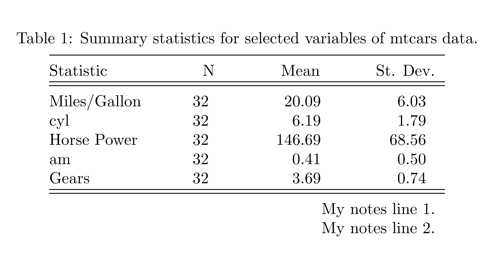

```{r setup, include=FALSE}
knitr::opts_chunk$set(collapse = FALSE)
```


# Pros & Cons

### Pros {-}

1. Out-of-the-box, easy to use, all-in-one solution.
2. The package is "compulsory" for model estimation tables. So it only requires marginal effort to learn extra arguments in the function. As a side bonus, one gets the consistency in the formatting.

### Cons {-}

1. The package is somewhat flexible, and built to cover all the standard needs of the practitioners. But the advanced user is doomed to face a case that is not covered by the package options, forcing them to learn an alternative way.  


I do not use {stargazer} for summary statistics. Instead, I build my own tables with {dplyr} and {kableExtra}.[^post] But the package is so good and so accessible that R users cannot ignore.


# Minimal Example

Let's start with a minimal example that illustrates the usage of some the arguments related to the summary statistics.[^all]

```{r, message=FALSE}
# use chunk option message=FALSE to avoid package info in the output
library(stargazer)  
library(dplyr)
library(magrittr)
```

- The table is created in a R chunk that needs the chunk option `results='asis'`.
- `stargazer()` requires a base R data frame, not a tibble, hence the use of `as.data.frame()`,^[I don't understand this behavior! And it took me an hour to figure it out.]
- The selection of the variables to be included in the summary is easily done with {dplyr}.
- The argument `type` of table takes here a `ifelse` function so that the code works for all  the formats. In a research paper, `type='latex'` would suffice.[^web] 
- The `label` argument, required for {knitr}-type of cross-referencing, is a patch solution found [here](https://github.com/rstudio/bookdown/issues/175#issuecomment-422100007).
- The `title` argument is the caption of the table. In a pdf, it will typically be preceded by "Table 1:".
- The `header = FALSE` is a weird requirement: it prevents the package information to be printed in the pdf.


```{r summstat01, results='asis'}
mtcars %>% 
  select(mpg, cyl, hp, am, gear) %>% 
  as.data.frame() %>%
  stargazer(type = ifelse(knitr::is_html_output(), 'html', 'latex'),
            label = knitr::opts_current$get("label"),
            title = "Summary statistics for (part of) the mtcars data.",
            header = FALSE
            )
```


# Nicer 

Let's tweak the minimal case with some aesthetic elements.

- The options for the display of the numbers are quite straightforward: `digits` for the number of decimals, `digit.separator` for the thousands mark, `initial.zero` for yes/no the 0 before the comma.
- Change the name of the variables by giving a vector of names in the argument `covariate.labels`. Use `NA` in that vector for the 

```{r summstat02, results='asis'}
mtcars %>%
  select(mpg, cyl, hp, am, gear) %>% 
  as.data.frame() %>%
  stargazer(type = ifelse(knitr::is_html_output(), 'html', 'latex'),
            label = knitr::opts_current$get("label"),
            title = "Summary statistics for (part of) the mtcars data.",
            header = FALSE,
            
            digits = 2,
            digit.separator= "'",
            initial.zero = FALSE,
            covariate.labels = c("Miles/Gallon", NA, "Horse Power", NA, "Gears")
            )
```


# Selection 

The default statistics are coded internally with the following abbreviations: `n`, `mean`, `sd`, `min`,  `p25`, `p75`, `max` (shown by default in that order), and `median`.

You can choose which set of statistics to display:

- "positively" with `summary.stat` taking the vector of desired statistics to display,
- "negatively" with `omit.summary.stat` taking the vector of desired statistics to remove from the default.


```{r summstat03, results='asis', out.width="80%"}
mtcars %>%
  select(mpg, cyl, hp, am, gear) %>% 
  as.data.frame() %>%
  stargazer(type = ifelse(knitr::is_html_output(), 'html', 'latex'),
            label = knitr::opts_current$get("label"),
            title = "Summary statistics for (part of) the mtcars data.",
            header = FALSE,
            digits = 2,
            digit.separator= "'",
            initial.zero = FALSE,
            covariate.labels = c("Miles/Gallon", NA, "Horse Power", NA, "Gears"),
            
            # summary.stat = c("n", "mean", "sd", "median"),
            omit.summary.stat = c("min", "max", "p25", "p75")
            )
```


# Notes 

Extra explanatory notes to the table can be given in a character vector thanks to `notes`. **Each element** of the vector will be **a line** under the table.

Alignment of the notes is either `l`(eft), `c`(enter) or `r`(ight) given to `notes.align`.

```{r summstat04, results='asis', out.width="80%"}
mtcars %>%
  select(mpg, cyl, hp, am, gear) %>% 
  as.data.frame() %>%
  stargazer(type = ifelse(knitr::is_html_output(), 'html', 'latex'),
            label = knitr::opts_current$get("label"),
            title = "Summary statistics for (part of) the mtcars data.",
            header = FALSE,
            digits = 2,
            digit.separator= "'",
            initial.zero = FALSE,
            covariate.labels = c("Miles/Gallon", NA, "Horse Power", NA, "Gears"),
            # summary.stat = c("n", "mean", "sd", "median"),
            omit.summary.stat = c("min", "max", "p25", "p75"),
            
            notes = c("\\footnotesize{My notes line 1.}", "My notes line 2."),
            notes.align = "r"
            )
```


# $\LaTeX$

It is fair to say that {stargzer} was initially designed for academic publications. Many of these latter use $\LaTeX$ for text editing. So here are a few points to specifically address the usage with $\LaTeX.$       

- A group of users makes a surprising choice. They use R for data analysis and a $\LaTeX$ distribution for text editing. But they don't combine the these two tasks in a Rmd file.    
For this group of users, the {stargazer} table must find its way from the R code to the $\LaTeX$ file. This is achieved with the argument `out`.  The value of this latter is the name of the file, with extension (!),[^extension] that will contain the code of the table.[^notype]  
- `align` forces the numbers in the columns to be aligned at the decimal mark. This requires the usage of the $\LaTeX$ package {dcolumn}, to be included in the preamble of the tex file[^rmd]

```markdown
\usepackage{dcolumn}
```
 

- `table.placement` is used to give the placement specifier of the table: `h`(ere), `t`(op), `b`(ottom), `p`(age), along with the famous `!` to try to force $\LaTeX$ to override its default behavior.[^H]


```{r summstat05, results='asis'}
mtcars %>% 
  select(mpg, cyl, hp, am, gear) %>% 
  as.data.frame() %>%
  stargazer(label = "my-table-label",
            title = "Summary statistics for (part of) the mtcars data.",
            header = FALSE,
            digits = 2,
            digit.separator= "'",
            initial.zero = TRUE, 
            covariate.labels = c("Miles/Gallon", NA, "Horse Power", NA, "Gears"),
            # summary.stat = c("n", "mean", "sd", "median"),
            omit.summary.stat = c("min", "max", "p25", "p75"),
            notes = c("My notes line 1.", "My notes line 2."),
            notes.align = "r",
            
            out = "my-table.tex",
            align = TRUE,
            table.placement = "t!"
            )
```


```{r pdftable, echo = FALSE, message=FALSE, fig.align='center', fig.cap='Aspect of the above "my-table.tex" in pdf output.', out.width="100%"}

```


# Advanced 

Time for some advanced stuff.


[^post]: Stuff for another post.
[^all]: All the arguments of the function `stargazer()` can be found [here](https://www.rdocumentation.org/packages/stargazer/versions/5.2.3/topics/stargazer).
[^web]: Recall that you are reading this online. The format is slightly different from the format in the pdf.
[^extension]: Various extensions/ file types are possible.
[^notype]: Notice that the type of the table is not given by the argument `type` (I'm not even using it), but by the extension of the file name in `out`. 
[^H]: `H` is also possible in combination with `\usepackage{float}`.
[^rmd]:
Wise Rmd users will change the YAML to include,
```yaml
header-includes:
   - \usepackage{dcolumn}
```  

