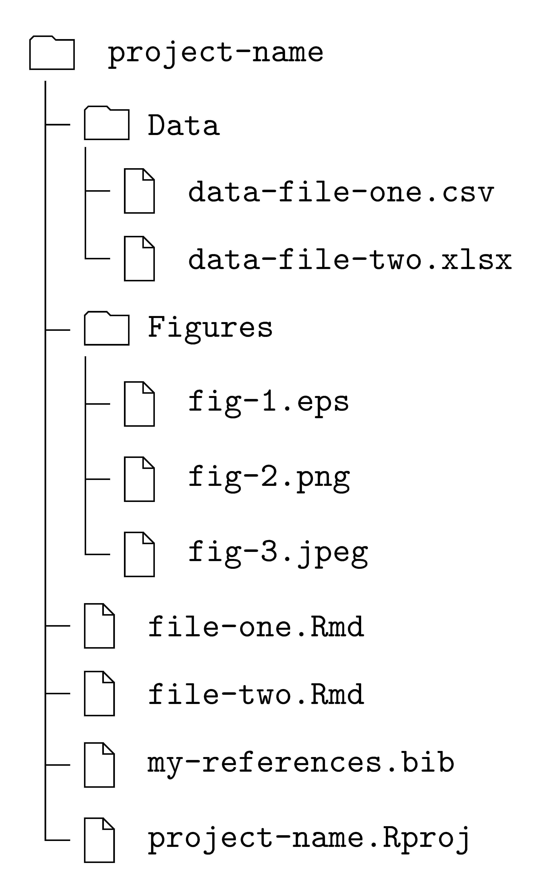
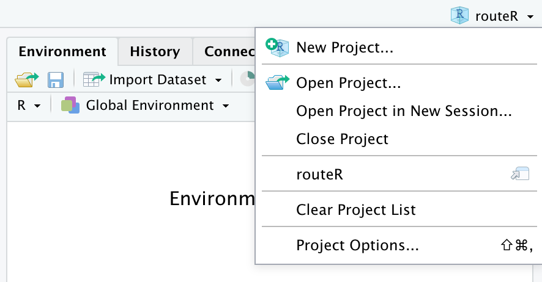

```{r setup, include=FALSE}
knitr::opts_chunk$set(collapse = FALSE, echo = TRUE)
library(magrittr)
library(dplyr)
library(ggplot2)
library(cowplot)
```


# Pros' Projects

Expert users, across coding languages, work in "projects". These are simply bundles that include and link together all the necessary files in a given... project. The RStudio IDE offers an easy way to do just that.   

This step in R expertise is a low-hanging, rich fruit. Consider that you don't need to change any file! In essence, you  have a  working directory^[I.e., a simple folder in your directory.] that will serve as the house of a R project.  

Telling RStudio that you work in a R project implies, under the hood, that files are not isolated but bundled together. This, in turn, facilitates greatly the connections between the files. In particular, [relative paths](https://antoniofidalgo.page/routeR/post/relativepath/) are given and found in an efficient and consistent way.   

Creating a R project in RStudio also unlocks various powerful features. For instance, RStudio understands that all the Rmd files in the project's working directory are part of a bundle. Therefore, it will offer the possibility of building them together into a single output. Books are built thus with each Rmd file being a chapter (or a section).      


# Creating a R Project

There are two main ways of creating a project:  

a. as the first step of a project,
b. by using an existing working directory.   

Below, we briefly present these two ways. Note that the recommended approach is to start a R project as the first step.


## R Project from New Directory

To start a project as a R project, use the RStudio menu `File > New Project...`.   

The pop-up window that appears couldn't be more explicit. It takes you to the three panes shown in Figure \@ref(fig:project-wizzard). 

1. Click on `New Directory` in the first.
2. Continue with `New Project` in the second.
3. Chose a name for the working directory of your project as well as what directory it should belong too. If the default location is not satisfactory, you can chose another through `Browse...`.

```{r project-wizzard, fig.cap="Creating a R project from a new directory.", fig.align = "center", fig.height=2, echo=FALSE}
p1 <- ggdraw() + draw_image("pwiz1.png", scale = 1)
p2 <- ggdraw() + draw_image("pwiz2.png", scale = 1)
p3 <- ggdraw() + draw_image("pwiz3.png", scale = 1)

plot_grid(p1, p2, p3, nrow=1)
``` 


### project-name.Rproj


The **name** of the working directory is important. It will also be automatically used the for name of your R project. It should describe this latter appropriately.^[For instance, "class1" is probably not general enough, while "classes" might not be sufficiently specific. "Master-thesis" is an excellent name for a project.] 


A first file **automatically** populates your working directory. It is of a new type, namely a file with **extension `.Rproj`**. Its content cannot be accessed. It would not be useful to access it anyway. Its presence in the directory simply means that the working directory is now considered as a "bundle" of files by RStudio. 

## R Project from Existing Directory

To create a R project from an existing directory, use the RStudio menu `File > New Project...`.   

The pop-up window that appears couldn't be more explicit. 

1. The first is the same as in Figure \@ref(fig:project-wizzard).
2. Only, now you must chose the second option `Existing Directory`.
3. This brings another pane where you must locate the folder that you want to use as working directory for your project.  

For instance, if you started working with a directory "Master-thesis", you can now define that directory as the working directory of your project.

```{r project-wizzard2, fig.cap="Creating a R project from an existing directory.", fig.align = "center", fig.height=2, echo=FALSE}
p1 <- ggdraw() + draw_image("pwiz1.png", scale = 1)
p2 <- ggdraw() + draw_image("pwiz4.png", scale = 1)

plot_grid(p1, p2, nrow=1)
``` 

# Structure of a R Project Working Directory 

The working directory of your R project is... a working directory. Beyond the presence of a new `.Rproj` file, nothing would distinguish it from a regular folder where you gathered your files.   

The working directory of the R project is like a house for your analysis. Therefore, it is good practice to keep the place tidy, especially by giving it a sensible structure. Figure \@ref(fig:directory) offers a minimal example of such a structure.

```{r directory, echo=FALSE, fig.cap='Example of tidy project working directory.', out.width='50%', fig.align='center'}

```

Notice the following elements.  

- Data files have their dedicated folder, "Data".
- Images, plots, gifs, etc... could all be parked in the same folder, "Figures".
- Your `.Rmd` files can stay at the root of the directory.
- So does the bibliography file, `.bib`.
- Because the directory was created/assigned as a project, RStudio automatically added the .Rproj file.   


# Workflow with a R Project

The workflow when using a R project implies a different starting point. Instead of directly opening a file to modify it, you now want to **open a project.** This will bring upfront the whole working directory in a new RStudio session.  Some of the changes include:

- automatically opens the files that were open in the previous sessions,
- the files of the working directory are listed in the "Files" tab of a dedicated pane,
- the working directory is automatically and correctly set,^[The benefit of this feature can only be fully appreciated by the users who were at least once surprised and frustrated by the way RStudio sets the working directory when working with individual `.Rmd` files. It might sometimes be surprising. This problem does not exist in a R project.] 
- new features appear in tabs, ...

The starting point is therefore, in the RStudio menu, `File > Open Project...`. You then browse through your directory to open the `.Rproj` file itself.

### Shortcut

Alternatively, since projects typically become part of the daily work, the RStudio IDE offers a shortcut for opening a R project in the form of a menu on the upper right corner. As shown in Figure \@ref(fig:open-rproj), this menu conveniently keeps a list of the projects that you have recently opened so that they can be accessed in one click.

```{r open-rproj, echo=FALSE, fig.cap="Shortcut for opening a R project in RStudio.", out.width='50%', fig.align='center'}

``` 


